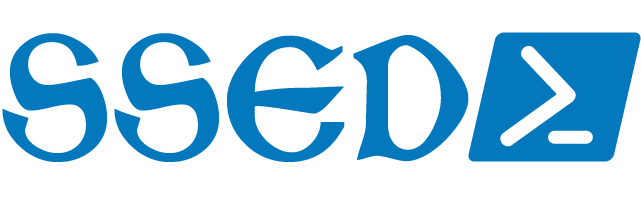
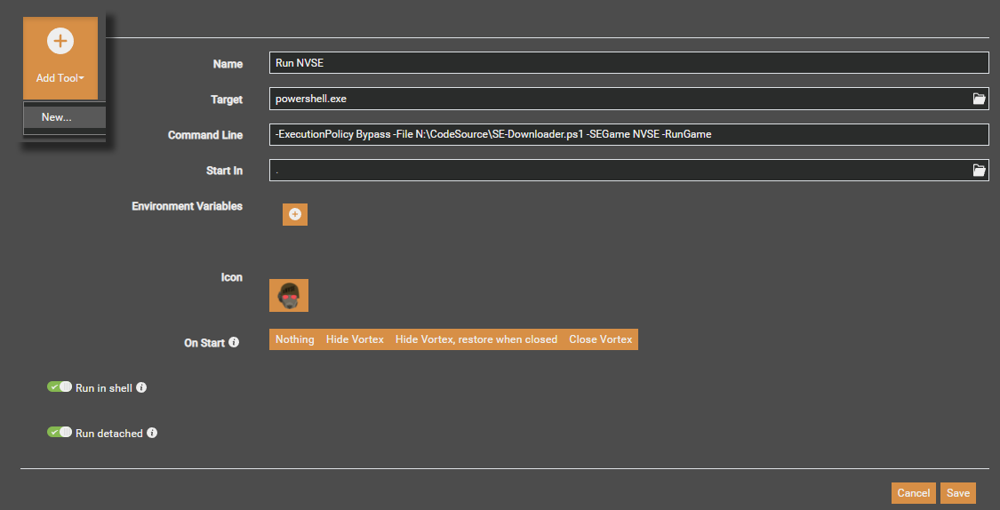

Powershell scripting that downloads and extracts the Silverlock Script Extenders for most Bethesda Gamebryo/Creation Engine games.

The Silverlock Team builds script extensions for Bethesda games, expanding the modding capability said games.
Currently supports:
- Fallout 3 (https://fose.silverlock.org/)
- Fallout: New Vegas (https://github.com/xNVSE/NVSE)
- Fallout 4 (https://f4se.silverlock.org/, https://github.com/ianpatt/f4se)
- Fallout 76 SFE (https://www.nexusmods.com/fallout76/mods/287)
- Skyrim Special/Anniversary Edition (https://skse.silverlock.org/, https://github.com/ianpatt/skse64)
- Skyrim Original Edition (https://www.nexusmods.com/skyrim/mods/100216)
- Skyrim VR (https://www.nexusmods.com/skyrimspecialedition/mods/30457)
- Oblivion (https://github.com/llde/xOBSE)
- Morrowind (https://www.nexusmods.com/morrowind/mods/45468)
    
To Do:
- [x] Skyrim - Plain Jane Elder Scrolls 5: Skyrim.  Should work, but I've not tested it
- [x] Skyrim VR - Do I buy it to verify? Really, all I need in the registry information for the Uninstall, make an issue here with the info for me!
- [x] Oblivion - The page and file format are radically different from the others, and has not been updated since 2013, so I'll get to it eventually.

Purpose:
- Checks for latest file version against locally installed
- Updates if available
- Runs if flag set

Parameters:
- `-SEGame <designation>` (four character game designation on silverlock.org)
- `-RunGame` (bool, default false)
- `-dlkeep` (bool, default false)
- `-hardpath` (string, file path to game folder)
- `-nexusAPI` (string, generated from https://www.nexusmods.com/users/myaccount?tab=api)

Usage:
- `se-downloader.ps1 -SEGame F4SE -RunGame`
  - Checks game for Fallout 4 Script Extender, and launches the game when completed
  - `se-downloader.ps1 -SEGame FOSE -hardpath "G:\FO3GOTY"`
  - Checks game for Fallout 3 with a direct install path
- `se-downloader.ps1 -SEGame SKSE64`
  - Checks game for Skyrim Special Edition Script Extender
- `se-downloader.ps1 -SEGame F76SFE -dlkeep -nexusAPI "NexusMods SSED API Key"`
  - Checks game for Fallout 76 SFE, an overlay DLL for Text Chat, requires NexusMods API Key, and does not delete the extracted download

For Vortex users, add a new tool to your managed game (you'll have to do this for each game)
- Target: `powershell.exe`
- Command Line: `-ExecutionPolicy Bypass -File SE-Downloader.ps1 -SEGame NVSE -RunGame`
- Enable "Run in Shell"
- Once added, I personally make this my primary launch option (three dots in the tool, dropdown menu "Make primary", should put a little flag on it)
