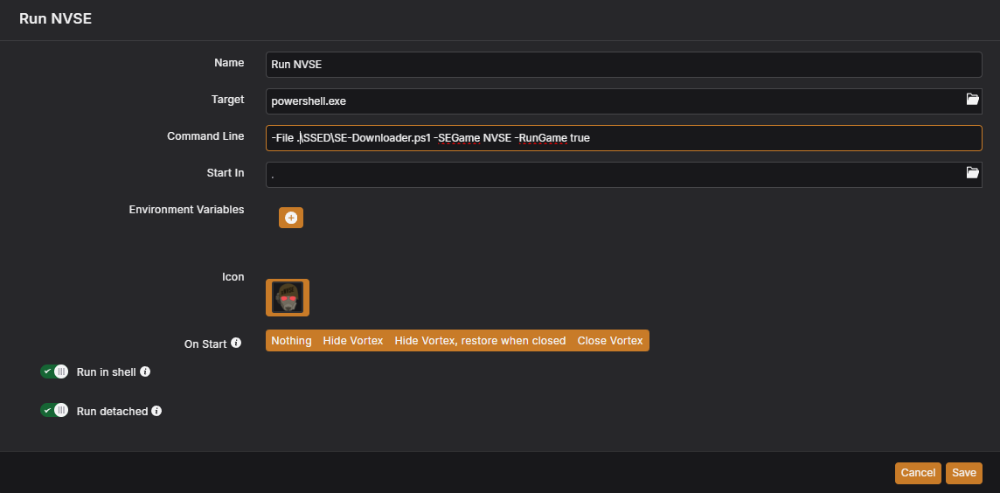
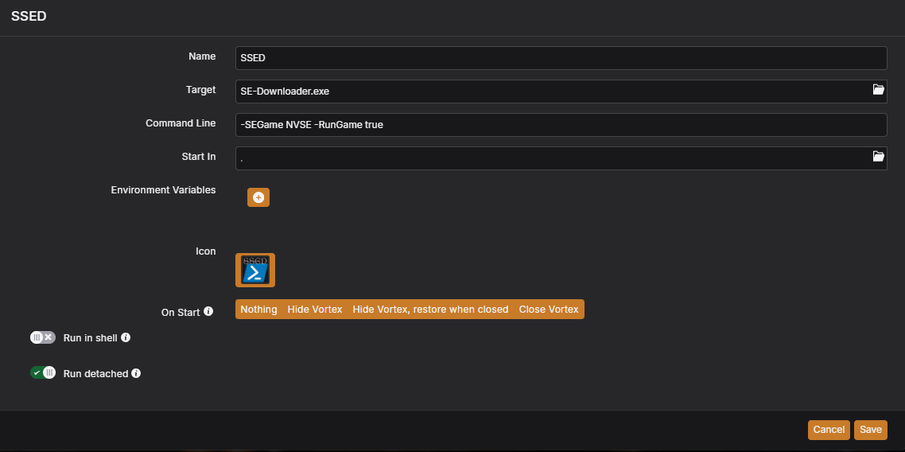

Powershell scripting that downloads and extracts the Silverlock Script Extenders for most Bethesda Gamebryo/Creation Engine games.

NOW WITH CODE SIGNING!

The Silverlock Team builds script extensions for Bethesda games, expanding the modding capability said games.
Currently supports:
- Fallout 3 (https://fose.silverlock.org/)
- Fallout: New Vegas (https://github.com/xNVSE/NVSE)
- Fallout 4 (https://f4se.silverlock.org/, https://github.com/ianpatt/f4se)
   - Fallout: London is supported, and selects the F4SE to match
- Fallout 76 SFE (https://www.nexusmods.com/fallout76/mods/287)
- Skyrim Special/Anniversary Edition (https://skse.silverlock.org/, https://github.com/ianpatt/skse64)
- Skyrim Original Edition (https://www.nexusmods.com/skyrim/mods/100216)
- Skyrim VR (https://www.nexusmods.com/skyrimspecialedition/mods/30457)
- Oblivion (https://github.com/llde/xOBSE)
- Oblivion Remastered (http://nexusmods.com/oblivionremastered/mods/282)
- Morrowind (https://www.nexusmods.com/morrowind/mods/45468)
- Starfield (https://www.nexusmods.com/starfield/mods/106)
- Starfield (https://www.nexusmods.com/starfield/mods/106)

Purpose:
- Checks for latest file version against locally installed
- Updates if available
- Runs if flag set

Note for unsigned version: The command line parameters had to change for the compiled executable release, so update `-RunGame` and `-dlkeep` to be `-RunGame true` and `-dlkeep true`. The default value for both parameters is still `false`.

Parameters:
- `-SEGame <designation>` (four character game designation on silverlock.org)
- `-RunGame <true/false>` (string, default false)
- `-dlkeep <true/false>` (string, default false)
- `-hardpath` (string, file path to game folder)
- `-nexusAPI` (string, generated from https://www.nexusmods.com/users/myaccount?tab=api)

Usage:
- `se-downloader.ps1 -SEGame F4SE -RunGame true`
  - Checks game for Fallout 4 Script Extender, and launches the game when completed
  - `se-downloader.ps1 -SEGame FOSE -hardpath "G:\FO3GOTY"`
  - Checks game for Fallout 3 with a direct install path
- `se-downloader.ps1 -SEGame SKSE64`
  - Checks game for Skyrim Special Edition Script Extender
- `se-downloader.ps1 -SEGame F76SFE -dlkeep true -nexusAPI "NexusMods SSED API Key"`
  - Checks game for Fallout 76 SFE, an overlay DLL for Text Chat, requires NexusMods API Key, and does not delete the extracted download

For Vortex users, add a new tool to your managed game (you'll have to do this for each game)
- Target: `C:\Windows\System32\WindowsPowerShell\v1.0\powershell.exe`
  - Note: You must use the full path to the PowerShell executable, or Vortex will not present the Run option.
- Command Line: `-File SE-Downloader.ps1 -SEGame NVSE -RunGame true`
- Enable "Run in Shell"
- Once added, I personally make this my primary launch option (three dots in the tool, dropdown menu "Make primary", should put a little flag on it)

